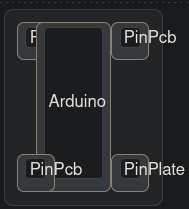
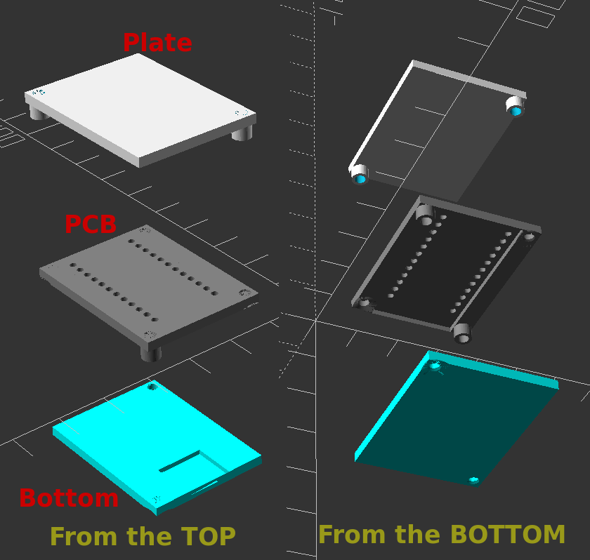

= KLE Examples

One of the downside of using Keyboard-Layout-Editor(KLE) to place all the components is the different scale of every part. When we are using KLE we are using keys Units, which is 19.05mm. Then we would need to play with the location of every part to meet our desirers

== Arduino
When we are using Arduino, we would create a button with the following KLE specification:

* width: 1
* Height: 2.25
* Middle Legend: Arduino

.KLE Example with Arduino, PCB Pins, and Plate Pins.

[source,json]
.JSON content
----
[{a:7,w:0.5,h:0.5},"PinPlate",{x:-0.25,h:2.25},"Arduino",{w:0.5,h:0.5},"PinPcb"],
[{y:0.75,w:0.5,h:0.5},"PinPcb",{x:0.75,w:0.5,h:0.5},"PinPlate"]
----

.3D Object Example with Arduino, PCB Pins, and Plate Pins.

== Pins
We have two types of pins, PCB Pins and Plate Pins.

* The Plate Pins are used to hold the PCB with the correct distance for the keys.
* The PCB Pins are used to hold the PCB to the bottom plate.
